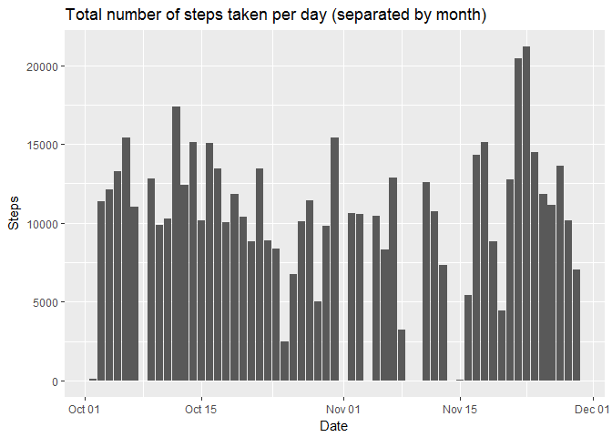
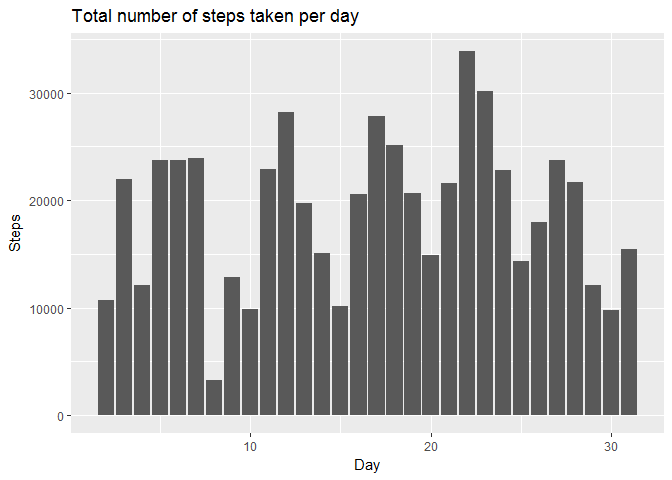
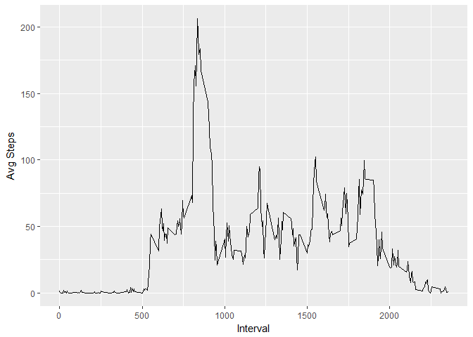
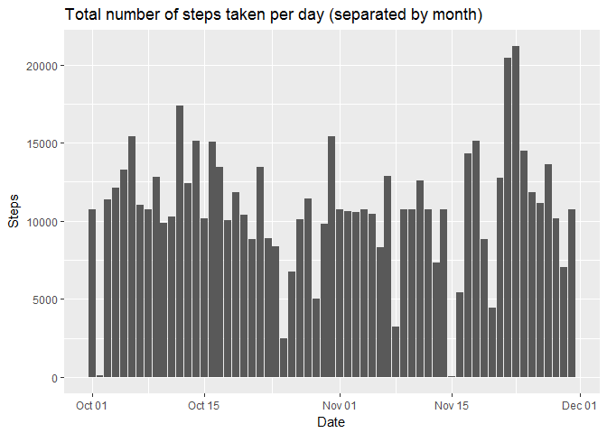
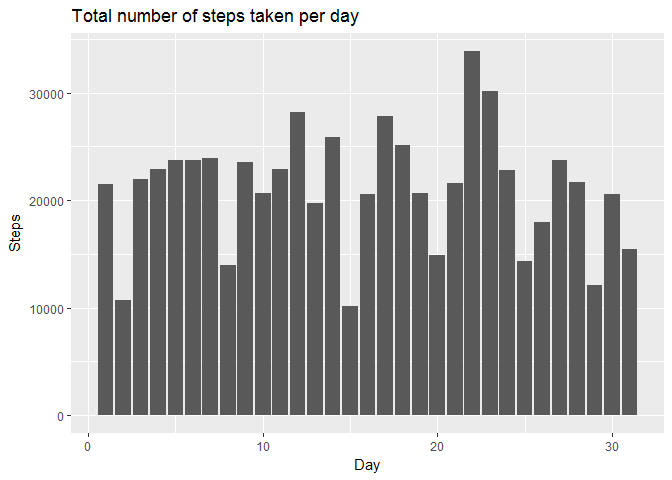
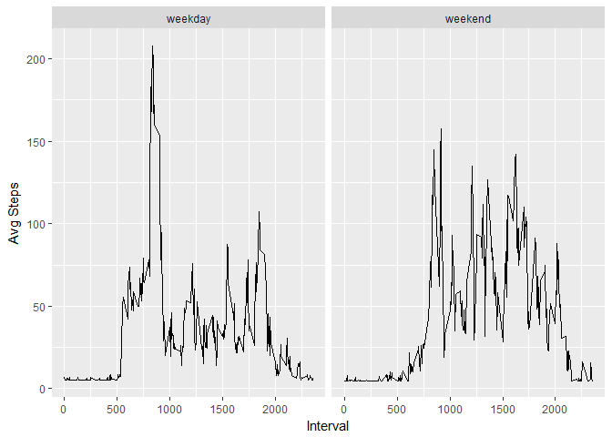

Loading and preprocessing the data
----------------------------------

    library(lubridate)
    library(ggplot2)
    Sys.setlocale("LC_TIME", "English")

    ## [1] "English_United States.1252"

    my_data <- read.csv("activity.csv", sep = ",", header = TRUE)
    my_data$date <- as.Date(my_data$date)
    my_data$day <- day(my_data$date)

Calculate the total number of steps taken per day
-------------------------------------------------

    my_subset <- na.omit(my_data)
    tst <- aggregate(my_subset$steps ~ my_subset$date, FUN = sum)
    tst[,2]

    ##  [1]   126 11352 12116 13294 15420 11015 12811  9900 10304 17382 12426
    ## [12] 15098 10139 15084 13452 10056 11829 10395  8821 13460  8918  8355
    ## [23]  2492  6778 10119 11458  5018  9819 15414 10600 10571 10439  8334
    ## [34] 12883  3219 12608 10765  7336    41  5441 14339 15110  8841  4472
    ## [45] 12787 20427 21194 14478 11834 11162 13646 10183  7047

#### Make a histogram of the total number of steps taken each day

    ggplot(my_subset, aes(x=date, y=steps)) + geom_histogram(stat="identity", binwidth = 30) + 
      ggtitle("Total number of steps taken per day (separated by month)") + xlab("Date") + ylab("Steps")

    ## Warning: Ignoring unknown parameters: binwidth, bins, pad

    ggplot(my_subset, aes(x=day, y=steps)) + geom_histogram(stat="identity") + 
      ggtitle("Total number of steps taken per day") + xlab("Day") + ylab("Steps")

    ## Warning: Ignoring unknown parameters: binwidth, bins, pad

#### Calculate and report the mean and median of the total number of steps taken per day

    mean(tst[,2])

    ## [1] 10766.19

    median(tst[,2])

    ## [1] 10765

What is the average daily activity pattern?
-------------------------------------------

#### Make a time series plot of the 5-minute interval and the average number of steps taken, averaged across all days

    avgSteps <- aggregate(my_subset$steps ~ my_subset$interval, FUN = mean)
    names(avgSteps) <- c("interval", "steps")
    ggplot(avgSteps, aes(x=avgSteps[,1], y=avgSteps[,2])) + geom_line() + xlab("Interval") + ylab("Avg Steps")

#### Which 5-minute interval, on average across all the days in the dataset, contains the maximum number of steps?

    avgSteps[avgSteps[,2] == max(avgSteps[,2]),]

    ##     interval    steps
    ## 104      835 206.1698

Imputing missing values
-----------------------

#### Calculate and report the total number of missing values in the dataset (i.e. the total number of rows with NAs)

    sum(is.na(my_data))

    ## [1] 2304

#### Devise a strategy for filling in all of the missing values in the dataset. The strategy does not need to be sophisticated.

#### Create a new dataset that is equal to the original dataset but with the missing data filled in.

    new_data <- my_data
    for(i in 1:nrow(new_data)){
      if(is.na(new_data$steps[i])){
        new_data$steps[i] <- mean(new_data$steps, na.rm = TRUE)
      }
    }
    sum(is.na(new_data))

    ## [1] 0

#### Make a histogram of the total number of steps taken each day and Calculate and report the mean and median total number of steps taken per day. Do these values differ from the estimates from the first part of the assignment? What is the impact of imputing missing data on the estimates of the total daily number of steps?

    ggplot(new_data, aes(x=date, y=steps)) + geom_histogram(stat="identity") + 
      ggtitle("Total number of steps taken per day (separated by month)") + xlab("Date") + ylab("Steps")

    ## Warning: Ignoring unknown parameters: binwidth, bins, pad

    ggplot(new_data, aes(x=day, y=steps)) + geom_histogram(stat="identity") + 
      ggtitle("Total number of steps taken per day") + xlab("Day") + ylab("Steps")

    ## Warning: Ignoring unknown parameters: binwidth, bins, pad

    a <- aggregate(new_data$steps ~ new_data$date, FUN = sum)
    mean(a[,2])#no change

    ## [1] 10766.19

    median(a[,2])#small change

    ## [1] 10766.19

Are there differences in activity patterns between weekdays and weekends?
-------------------------------------------------------------------------

#### Create a new factor variable in the dataset with two levels - "weekday" and "weekend" indicating whether a given date is a weekday or weekend day.

    new_data$weekday <- ifelse(weekdays(new_data$date) == "Saturday" | weekdays(new_data$date) == "Sunday", "weekend", "weekday")
    table(new_data$weekday)

    ## 
    ## weekday weekend 
    ##   12960    4608

#### Make a panel plot containing a time series plot (i.e. type = "l") of the 5-minute interval (x-axis) and the average number of steps taken, averaged across all weekday days or weekend days (y-axis).

    agg <- aggregate(new_data$steps, list(new_data$interval, new_data$weekday), FUN = mean)
    names(agg) <- c("steps", "weekday", "interval")

    ggplot(agg, aes(x=steps, y=interval)) + geom_line() + xlab("Interval") + ylab("Avg Steps") + facet_grid(.~weekday)

